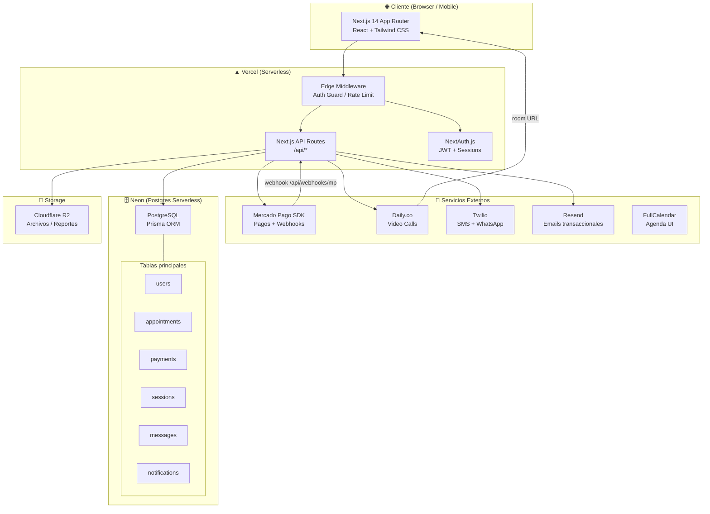
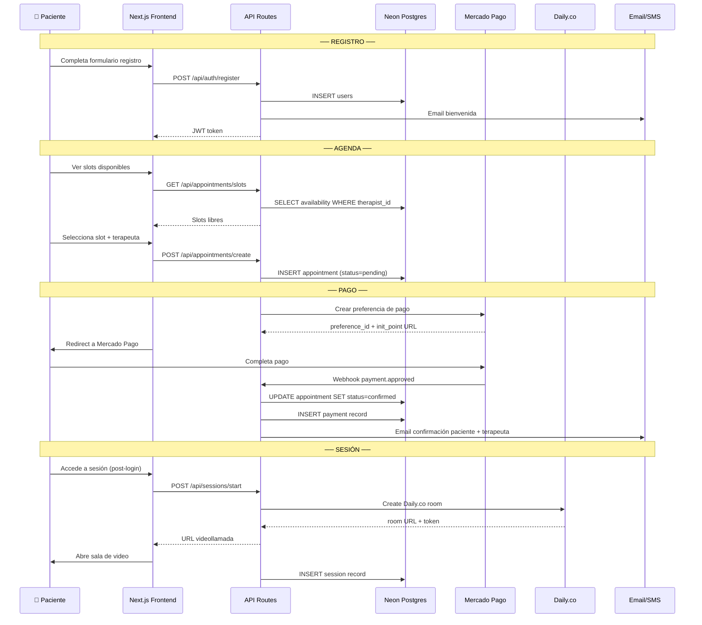

# 🏛️ Arquitectura — Clínica Espiritual de Terapias Psicológicas Online

## 1. High-Level Architecture



---

## 2. Flujo de Datos Principal



---

## 3. Stack Tecnológico Justificado

| Capa | Tecnología | Justificación |
|------|------------|---------------|
| Frontend | Next.js 14 (App Router) | SSR + SSG, SEO, file-based routing, deploy Vercel nativo |
| Auth | NextAuth.js v5 | JWT + sessions, providers Email/OAuth, integra Prisma |
| ORM | Prisma | Type-safe, migraciones, compatible Neon/Postgres |
| DB | Neon Postgres (serverless) | Branching, auto-scale, compatible Prisma, free tier generoso |
| Pagos | Mercado Pago SDK oficial | Requerido; soporta LATAM, webhooks, split payments |
| Video | Daily.co | API simple, SDK React, rooms temporales, sin infra propia |
| Email | Resend | Moderno, React Email templates, excelente deliverability |
| SMS | Twilio | Estándar industria, WhatsApp Business API disponible |
| Calendario | FullCalendar | Open-source, React component, agenda + disponibilidad |
| Storage | Cloudflare R2 | S3-compatible, barato, para reportes PDF y archivos |
| Hosting | Vercel | Serverless functions, edge, integración GitHub nativa |
| Styling | Tailwind CSS + shadcn/ui | Rapid UI, accesible, customizable |

---

## 4. Roles y Permisos

```
ADMIN
  ├── Gestionar terapeutas y pacientes
  ├── Ver todos los pagos y reportes
  ├── Configurar disponibilidad global
  └── Acceso total al sistema

THERAPIST  
  ├── Ver/gestionar sus propias citas
  ├── Iniciar sesiones de video
  ├── Crear notas clínicas y reportes
  ├── Chatear con pacientes asignados
  └── Ver su propio calendario

PATIENT
  ├── Ver slots disponibles y agendar
  ├── Pagar sesiones (Mercado Pago)
  ├── Acceder a sus sesiones (video/chat)
  ├── Ver su historial y reportes
  └── Mensajes con su terapeuta
```

---

## 5. Compliance GDPR/HIPAA-like

- **Encriptación en tránsito**: TLS 1.3 (Vercel + Neon)
- **Encriptación en reposo**: Neon encripta datos en disco
- **Datos sensibles**: Notas clínicas encriptadas con AES-256 (campo level)
- **Auditoría**: Tabla `audit_logs` con todas las acciones
- **Retención**: Política configurable, datos borrados bajo solicitud
- **Consentimiento**: Checkbox explícito en registro, guardado en DB
- **Acceso mínimo**: Row-level security (RLS) en Postgres por rol
- **Backups**: Neon point-in-time recovery automático
- **Videos**: Daily.co no graba por defecto; configurar end-to-end encryption

---

## 6. Estructura de Carpetas (Monorepo)

```
clinica-espiritual-psicologica/
├── app/                          # Next.js App Router
│   ├── (auth)/
│   │   ├── login/page.tsx
│   │   └── register/page.tsx
│   ├── (dashboard)/
│   │   ├── layout.tsx            # Auth guard
│   │   ├── dashboard/page.tsx    # Patient dashboard
│   │   ├── agenda/page.tsx       # Calendario + reservas
│   │   ├── sesiones/page.tsx     # Video sessions
│   │   ├── mensajes/page.tsx     # Chat seguro
│   │   └── reportes/page.tsx     # Progreso y notas
│   ├── (admin)/
│   │   ├── layout.tsx            # Admin guard
│   │   ├── terapeutas/page.tsx
│   │   ├── pacientes/page.tsx
│   │   └── pagos/page.tsx
│   ├── api/
│   │   ├── auth/[...nextauth]/route.ts
│   │   ├── appointments/
│   │   │   ├── route.ts          # GET list, POST create
│   │   │   └── slots/route.ts    # GET available slots
│   │   ├── payments/
│   │   │   ├── create/route.ts   # POST - crear preferencia MP
│   │   │   └── webhook/route.ts  # POST - webhook MP
│   │   ├── sessions/
│   │   │   ├── start/route.ts    # POST - crear room Daily.co
│   │   │   └── end/route.ts      # POST - cerrar sesión
│   │   ├── messages/route.ts
│   │   └── users/route.ts
│   └── layout.tsx
├── components/
│   ├── ui/                       # shadcn/ui components
│   ├── calendar/                 # FullCalendar wrapper
│   ├── video/                    # Daily.co component
│   └── dashboard/
├── lib/
│   ├── prisma.ts                 # Prisma client singleton
│   ├── auth.ts                   # NextAuth config
│   ├── mercadopago.ts            # MP SDK setup
│   ├── daily.ts                  # Daily.co API
│   ├── resend.ts                 # Email client
│   └── twilio.ts                 # SMS client
├── prisma/
│   ├── schema.prisma             # DB Schema
│   └── migrations/
├── emails/                       # React Email templates
│   ├── WelcomeEmail.tsx
│   ├── AppointmentConfirmed.tsx
│   └── SessionReminder.tsx
├── types/
│   └── index.ts
├── middleware.ts                 # Auth guard + rate limiting
├── .env.local                    # Variables de entorno
└── package.json
```
